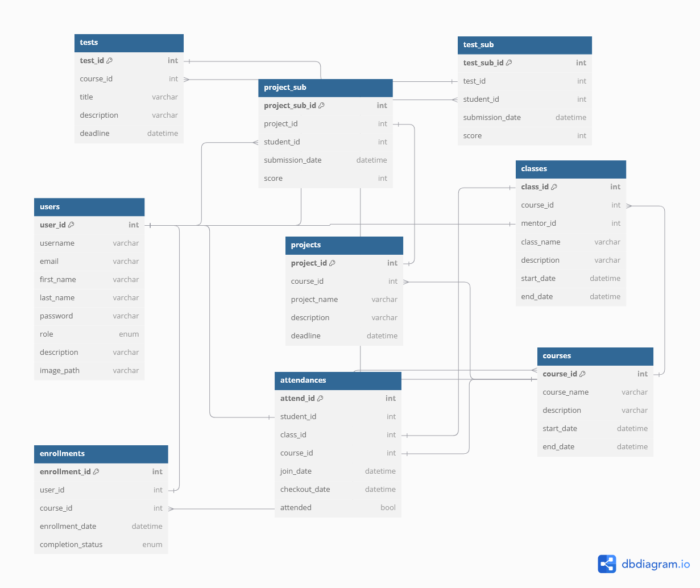

# Go-Learn
Learning Management System API

## Database Relational


## Features

- **User Management**:  
  - Role-based access for students, mentors, and administrators.
  - User signup and login with validation for unique usernames, emails, and secure passwords.

- **Class and Course Management**:  
  - Create and manage courses.
  - Enrollment system for students and mentors.

- **Attendance and Projects**:  
  - Record student attendance.
  - Manage course-specific projects.

- **RESTful APIs**:  
  - Designed to work seamlessly with any front-end framework.
  - JSON-based responses for easy integration.

## Project Structure

```plaintext
go-learn/
├── config/            # Database and helper configurations
├── controller/        # Controllers handling HTTP requests
├── entity/            # Entity definitions for database models
├── middleware/        # Middleware for validation and security
├── model/             # Data transfer objects (DTOs)
├── repository/        # Repository layer for database queries
├── service/           # Business logic layer
├── main.go            # Entry point for the application
└── README.md          # Project documentation
